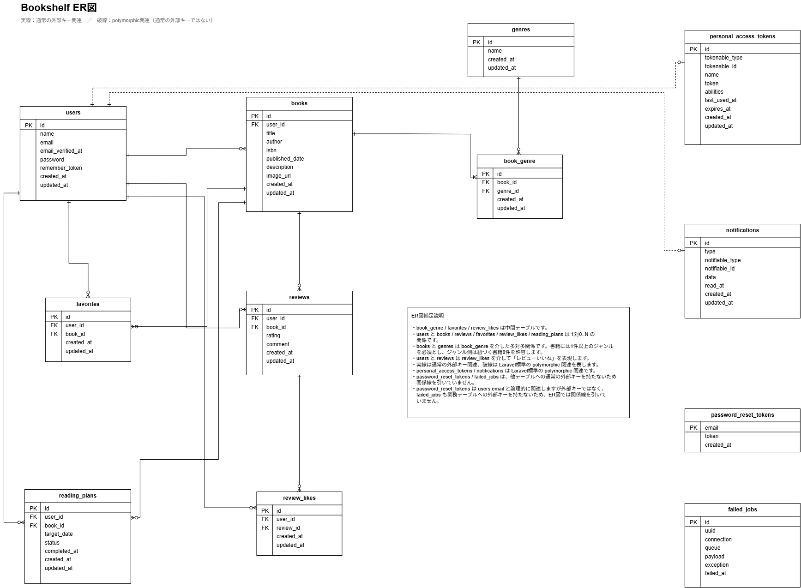

# アプリケーション名

 Bookshelf 書籍レビューアプリ

## 概要

書籍の登録・レビュー・お気に入り・ジャンル管理・ランキングなどを行うLaravel製の書籍レビューアプリケーションです。

未ログイン状態でも書籍一覧・書籍詳細を閲覧できます。

ログイン後は、書籍の登録・編集・削除、レビュー投稿・編集・削除、お気に入り、レビューへのいいね、ジャンル管理などの機能を利用できます。

基本機能の実装完了後は、検索・絞り込み・ソート、ISBN検索、読書レポート、読書計画、通知、公開APIのSanctum認証などの応用機能を実装します。

## 本アプリで実装する機能

### 基本機能

- 会員登録機能
- ログイン機能
- ログアウト機能
- 書籍一覧表示機能
- 書籍詳細表示機能
- 書籍登録機能
- 書籍編集機能
- 書籍削除機能
- レビュー投稿機能
- レビュー編集機能
- レビュー削除機能
- お気に入り登録・解除機能
- お気に入り一覧表示機能
- レビューいいね登録・解除機能
- ジャンル一覧表示機能
- ジャンル詳細表示機能
- ジャンル登録機能
- ジャンル編集機能
- ジャンル削除機能
- 書籍ランキング機能
- 公開API（書籍一覧・詳細・登録・更新・削除）

### 応用機能

- 書籍キーワード検索機能
- ジャンル絞り込み機能
- 書籍ソート機能
- 検索条件を保持したページネーション
- Google Books APIを利用したISBN-13検索機能
- マイ読書レポート機能
- 読書計画機能
- 読了処理
- 読書計画リマインダー通知
- 未読通知件数のバッジ表示
- 日次バッチ処理
- Laravel SanctumによるAPIトークン認証
- BookPolicyによるAPI認可

## 環境構築

### 1. リポジトリをクローン

```bash
git clone <GitHubリポジトリURL>
```

```bash
cd bookshelf-app
```

> GitHubリポジトリURLは、提出時に実際のURLへ置き換えてください。

### 2. Composer依存パッケージをインストール

Laravel Sailを起動するため、依存パッケージをインストールします。

```bash
docker run --rm \
    -u "$(id -u):$(id -g)" \
    -v "$(pwd):/var/www/html" \
    -w /var/www/html \
    -e COMPOSER_CACHE_DIR=/tmp/composer_cache \
    laravelsail/php82-composer:latest \
    composer install
```

### 3. `.env.example` をコピーして `.env` を作成

```bash
cp .env.example .env
```

### 4. `.env` のデータベース設定を確認

```env
DB_CONNECTION=mysql
DB_HOST=mysql
DB_PORT=3306
DB_DATABASE=bookshelf
DB_USERNAME=sail
DB_PASSWORD=password
```

`DB_HOST` には `localhost` や `127.0.0.1` ではなく、Dockerコンテナ名の `mysql` を指定します。

### 5. Laravel Sailを起動

```bash
./vendor/bin/sail up -d
```

Sailのエイリアスを設定している場合は、以下でも起動できます。

```bash
sail up -d
```

### 6. アプリケーションキーを生成

```bash
sail artisan key:generate
```

### 7. フロントエンド依存パッケージをインストール

```bash
sail npm install
```

### 8. データベースを作成し、初期データを投入

```bash
sail artisan migrate --seed
```

既存のデータベースをリセットして再構築する場合は、以下を実行します。

```bash
sail artisan migrate:fresh --seed
```

### 9. フロントエンドをビルド

```bash
sail npm run build
```

開発中にVite開発サーバーを使用する場合は、以下を実行します。

```bash
sail npm run dev
```

### 10. キャッシュをクリア

必要に応じて以下を実行します。

```bash
sail artisan optimize:clear
```

### 11. テストを実行

```bash
sail artisan test
```

### 12. Laravel Pintを実行

コードフォーマットを整えます。

```bash
sail bin pint
```

フォーマット違反がないことだけ確認する場合は、以下を実行します。

```bash
sail bin pint --test
```

## 使用技術

- PHP 8.5.10
- Laravel 10.50.3
- Laravel Fortify
- Laravel Sail
- MySQL 8.4
- phpMyAdmin
- Vite
- Tailwind CSS v3
- @tailwindcss/forms
- Alpine.js
- PHPUnit
- Laravel Pint
- Laravel Sanctum（応用機能）
- Google Books API（応用機能）

## 作成者

桝田 睦郎

## URL

### Web画面

- トップ／書籍一覧：http://localhost/
- 書籍一覧：http://localhost/books
- 会員登録：http://localhost/register
- ログイン：http://localhost/login
- お気に入り一覧：http://localhost/favorites
- ジャンル一覧：http://localhost/genres
- ランキング：http://localhost/ranking
- phpMyAdmin：http://localhost:8080

### 応用画面

- マイ読書レポート：http://localhost/reports
- 読書計画一覧：http://localhost/reading-plans
- 通知一覧：http://localhost/notifications

### 公開API

- 書籍一覧：GET `/api/v1/books`
- 書籍詳細：GET `/api/v1/books/{book}`
- 書籍登録：POST `/api/v1/books`
- 書籍更新：PUT `/api/v1/books/{book}`
- 書籍削除：DELETE `/api/v1/books/{book}`

基本要件では公開APIの認証は不要です。

応用要件では、POST・PUT・DELETEにLaravel SanctumによるBearerトークン認証を適用し、PUT・DELETEはBookPolicyにより書籍登録者本人のみ操作可能とします。

## ログイン情報

初期データとして以下の5ユーザーを登録します。

| ユーザー名 | メールアドレス | パスワード |
|---|---|---|
| 山田太郎 | yamada@example.com | password |
| 鈴木花子 | suzuki@example.com | password |
| 田中一郎 | tanaka@example.com | password |
| 佐藤美咲 | sato@example.com | password |
| 高橋健太 | takahashi@example.com | password |

## 初期データ

基本要件ではSeederにより以下のデータを投入します。

- ユーザー：5件
- ジャンル：10件
- 書籍：11件
- レビュー：32件
- お気に入りデータ
- レビューいいねデータ

ジャンルは以下の10件です。

1. 小説
2. ビジネス
3. 技術書
4. 自己啓発
5. エッセイ
6. 歴史
7. 科学
8. 芸術
9. 料理
10. 旅行

## ER図



## 補足

### デザイン仕様

提供UIと提供Bladeに差異がある場合は、提供Bladeを正しいデザイン仕様として実装します。

Original UIは原本として保持し、実装時に確定したUI・画面遷移との差異は実装反映版UIへ反映します。

### 提供Blade・UIとの差異対応

実装時に提供Blade自体の誤り、または既存要件との表示上の不整合が確認された場合は、
機能要件を変更するのではなく、要件に合わせて提供Bladeを修正します。

#### ジャンル詳細画面の戻るリンク

`resources/views/genres/show.blade.php` の「一覧に戻る」リンクが
書籍一覧 `books.index` へ遷移する記述となっていたため、
ジャンル管理 `genres.index` へ戻るよう修正しています。

本修正は、クライアント確認により提供Blade側の誤りと確認されたための修正であり、
機能要件の変更ではありません。

#### レビュー編集画面の評価表示

`resources/views/reviews/edit.blade.php` では、
既存評価が3の場合に3番目の★のみ黄色表示される状態となっていたため、
現在の評価値までの★を黄色表示するよう修正しています。

例：

- 評価1：★☆☆☆☆
- 評価3：★★★☆☆
- 評価5：★★★★★

Alpine.jsで現在のrating以下の★を黄色表示し、
既存の「現在の評価を選択状態で表示する」という要件と整合させています。

本修正も機能要件の変更ではなく、既存要件に合わせたUI修正です。

### 会員登録後のログイン仕様

会員登録が正常に完了した後は、自動ログインせず、ログイン画面へ遷移します。

本仕様は、会員登録の完了とログイン操作を明確に分けることで、ユーザーが「登録が完了したこと」と「これからログインして利用を開始すること」を認識しやすくするために採用しています。

また、会員登録後にログイン画面へ遷移する、またはログインへの導線を提示する形式は、ユーザーにとって理解しやすい認証フローの一つです。本アプリでも、登録後の次の操作を明確にすることを重視し、この流れとしています。

Laravel Fortifyの標準動作では、会員登録後にユーザーが自動ログインされますが、Bookshelfでは上記の仕様に合わせ、登録後にログイン状態を解除し、ログイン画面へリダイレクトするようにしています。

この処理はFortify本体のvendorコードを変更せず、`RegisterResponse`を独自実装してFortifyのレスポンス処理を差し替えることで実現しています。

処理の流れは以下のとおりです。

1. 会員登録フォームを送信する
2. `CreateNewUser.php`でユーザーを登録する
3. Fortifyの標準処理により一度ログイン状態になる
4. 独自の`RegisterResponse`でログアウトする
5. セッションを無効化し、CSRFトークンを再生成する
6. ログイン画面へリダイレクトする

### CSV出力

提供BladeにCSV出力機能がないため、本案件ではCSV出力を実装対象外とします。

### Basic / AdvancedのISBN-13・出版日

書籍登録・更新時のISBN-13と出版日は以下の仕様です。

- Basic：ISBN-13・出版日ともに必須
- Advanced：ISBN-13・出版日ともに任意

### ジャンル削除

ジャンルに紐づく書籍が0件の場合のみ削除できます。

書籍が1件以上紐づいている場合は削除しません。

### レビューいいね

レビューへのいいねはトグル方式です。

同一ユーザーが同一レビューへ重複していいねすることはできません。

また、自分が投稿したレビューにはいいねできません。

### ランキング

レビューが投稿されている書籍を平均評価の高い順に上位10冊表示します。

### 応用機能の通知

未読通知が1件以上ある場合、共通ヘッダーのベルアイコンに未読件数をバッジ表示します。

### 応用機能の日次バッチ

日次バッチは毎日20:00に実行します。

### API

書籍一覧・書籍詳細APIでは認証を要求しません。

応用要件では書き込み系APIにLaravel Sanctumを導入し、Bearerトークンによる認証を行います。

書籍更新・削除はBookPolicyにより、書籍登録者本人のみ操作可能とします。
